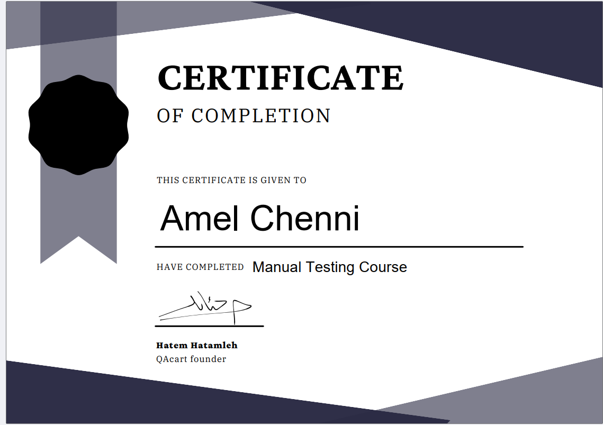

# 🛡️ Manual QA Project: To-Do Application (Signup Feature)

🌐 **Project Documentation:** [**Insert your Google Sheet Link here**](https://docs.google.com/spreadsheets/d/1MliztrE7Gfmjawfpu6L-VFE9wZbYD2FSqcDvXYrEEE4/edit?gid=0#gid=0)

---

## 📖 Description
This repository showcases the practical application of **Manual Quality Assurance (QA) principles** learned during the **QACart Manual Testing Bootcamp**. The focus of this project was the **Signup feature** of a web-based To-Do application.

The goal was to deliver high-quality test artifacts and identify critical defects before release, ensuring the feature meets functional, performance, and basic security standards.

### Key Project Deliverables
- **Comprehensive Test Checklist:** A structured set of 15+ test cases covering multiple testing types.
- **Defect Reporting:** Professional documentation of 4 discovered bugs, complete with steps, expected results, **Priority**, and **Severity**.

---

## 🚀 Key QA Skills & Features
- **🔬 Functional & Negative Testing:** Verified core business requirements and tested the system with invalid or unexpected input (e.g., leaving required fields blank).
- **🚧 Boundary Value Analysis (BVA):** Strategically tested the minimum and maximum permissible values for input fields (e.g., name length validation).
- **🛡️ Basic Security Testing:** Conducted preliminary security checks for common vulnerabilities like **SQL Injection** and **Cross-Site Scripting (XSS)**.
- **📝 Defect Lifecycle Management:** Created clear, actionable **Bug Reports** that follow industry best practices, ensuring efficient communication with developers.
- **📊 Test Artifact Management:** Utilized **Google Sheets** for organized, traceable, and detailed test case and bug documentation.

---

## 🛠️ Technologies Used

- **Manual Testing Techniques** — Applied various test design techniques (Equivalence Partitioning, Boundary Value Analysis).
- **Google Sheets / Excel** — Primary tool for creating, organizing, and managing all **Test Cases** and **Defect Reports**.
- **Browser Developer Tools** — Used for observing network responses, status codes, and inspecting the Console for client-side errors.
- **GitHub** — Used for cloning the application source code and for hosting the final QA artifacts.
- **MongoDB** — Utilized to support the database backend for the local test environment.
- **Visual Studio Code (VS Code)** — Used as the primary editor/IDE for setting up and running the application on a local host.
- **QACart Manual Testing Bootcamp** — The training foundation and methodological framework.

---

## 📌 Project Status  

| Task | Status | Notes |
|------|--------|-------|
| Test Cases creation | ✅ Completed | All main features covered |
| Test Suites organization | ✅ Completed | Grouped by module & type |
| Bug reporting | ⚡ In Progress | Some minor UI/UX bugs pending |
| Test execution | ⚡ In Progress | Manual testing done for main flows |
| Test reporting | ⚡ In Progress | Summary reports being compiled |
| Automation setup | ❌ Not started | Planned for future improvement |

---

## 📷 Preview  

  
  

---

## 📌 Future Scope & Improvements
- **Test Automation:** Transition critical manual test cases into automated scripts using tools like **Selenium** or **Cypress**.
- **Performance Testing:** Implement load and stress testing on the signup endpoint using tools such as **JMeter**.
- **Usability Testing:** Conduct more extensive **UX/Usability** testing to improve the overall user experience.
